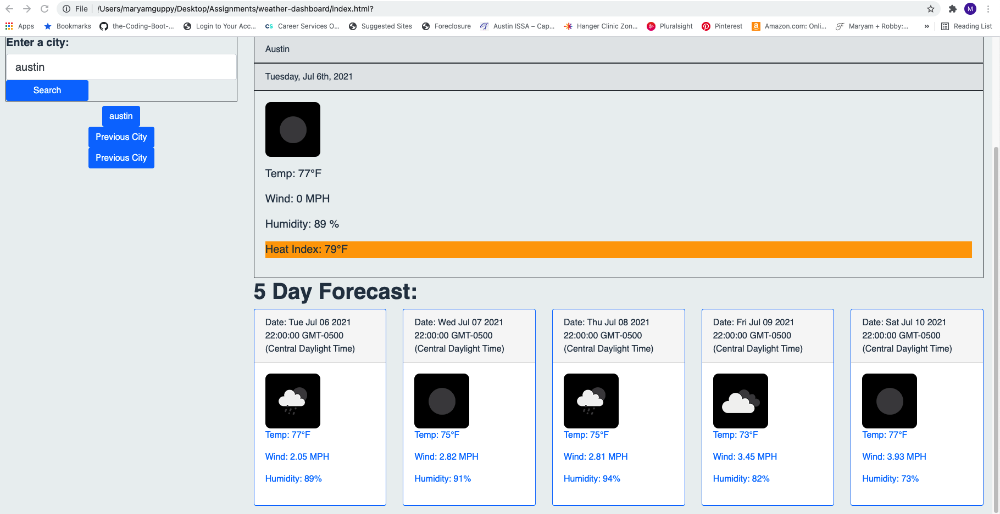

# weather-dashboard
Acceptance criteria - 

GIVEN a weather dashboard with form inputs
WHEN I search for a city
THEN I am presented with current and future conditions for that city and that city is added to the search history
WHEN I view current weather conditions for that city
THEN I am presented with the city name, the date, an icon representation of weather conditions, the temperature, the humidity, the wind speed, and the UV index
WHEN I view the UV index
THEN I am presented with a color that indicates whether the conditions are favorable, moderate, or severe
WHEN I view future weather conditions for that city
THEN I am presented with a 5-day forecast that displays the date, an icon representation of weather conditions, the temperature, the wind speed, and the humidity
WHEN I click on a city in the search history
THEN I am again presented with current and future conditions for that city

I built a weather dashboard that includes current weather conditions and future weather conditions for any city that the user searches.  The weather conditions include temperature, humidity, wind speed, UV index, etc.  If the UV index is above 90 degrees, the label turns red.  If the index is between 70 to 90, the label is orange and if below 70, the label is green.  The last three cities that were searched by the user appear in the past city buttons and are stored in local storage.  If the user clicks one of the buttons, it will bring back the city that the user previously searched.

Github link - https://github.com/mguppy/weather-dashboard

Credits: w3schools.com, my tutor, classmates and my programmer husband